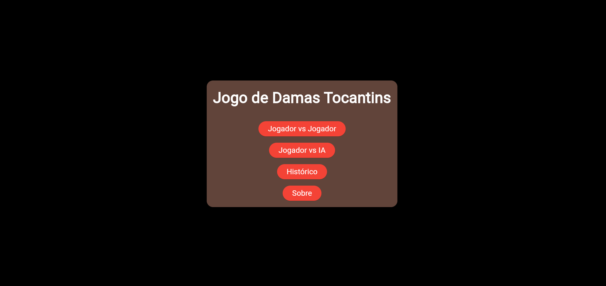
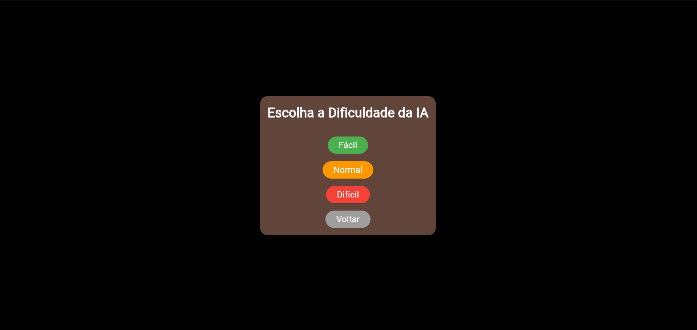
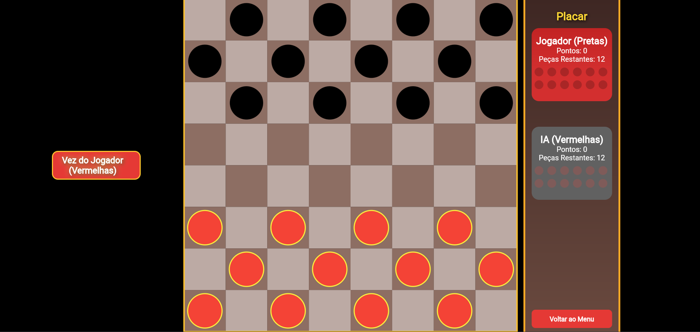

# ♟️ Jogo de Dama Tocantins

Bem-vindo ao **Jogo de Dama Tocantins**, uma implementação do clássico jogo de damas utilizando o framework [Flame](https://flame-engine.org/), voltado para desenvolvimento de jogos 2D com Flutter.

Este projeto reúne a lógica completa do jogo, interface gráfica intuitiva e uma inteligência artificial para partidas contra o computador.

🎮 **[Jogue agora online!](https://damas-tocantins.netlify.app/)**

---

## 🎮 Funcionalidades

- ✅ Regras oficiais de Damas implementadas
- 🧠 Modo de jogo contra IA
- 🧑‍🤝‍🧑 Modo multiplayer local (em desenvolvimento)
- 🎨 Interface gráfica interativa com Flutter + Flame
- 🔄 Detecção de movimentos válidos e capturas
- 🏆 Promoção automática para Dama

---

## 🧰 Tecnologias Utilizadas

- [Flutter](https://flutter.dev/) – SDK de interface moderna
- [Flame](https://flame-engine.org/) – Framework de jogos 2D para Flutter
- [Dart](https://dart.dev/) – Linguagem de programação principal
- [Flame Components](https://docs.flame-engine.org/) – Sistema de sprites, gestos e cenas

---

## 🚀 Como Executar o Projeto

### Pré-requisitos

- Flutter instalado ([Guia oficial](https://docs.flutter.dev/get-started/install))
- Versão mínima recomendada: `Flutter 3.10` ou superior

### Passos

```bash
# Clone o repositório
git clone https://github.com/MichaelDouglasCA/Jogo-de-Dama.git
cd Jogo-de-Dama

# Execute o projeto
flutter run
```

---

## 📱 Plataformas Suportadas

| Plataforma | Suporte   |
| ---------- | --------- |
| ✅ Android  | Sim       |
| ✅ Web      | Sim       |
| ✅ Windows  | Sim       |
| ⚠️ iOS     | Em testes |
| ⚠️ macOS   | Em testes |

---

## 📂 Estrutura do Projeto

```bash              
lib/        / Não há divisões em diversas partes, tudo em um unico arquivo! 
└── main.dart        # Ponto de entrada da aplicação 
```

---

## 📸 Capturas de Tela (opcional)

### Tela Inicial


### Tela de Dificuldade


### Partida Contra IA



---

## 🙋‍♂️ Contribuindo

Contribuições são bem-vindas! Sinta-se à vontade para:

* Reportar bugs
* Sugerir melhorias
* Criar pull requests

---

## 📄 Licença

Este projeto está licenciado sob a [MIT License](LICENSE).

---

## 🧑‍💻 Autores

Desenvolvido por **Michael Douglas** e **3d5onLP**  

🔗 [github.com/MichaelDouglasCA](https://github.com/MichaelDouglasCA)
🔗 [github.com/3d5onLP](https://github.com/3d5onLP)
